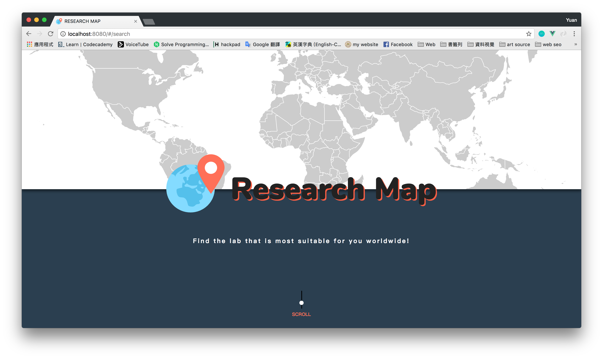
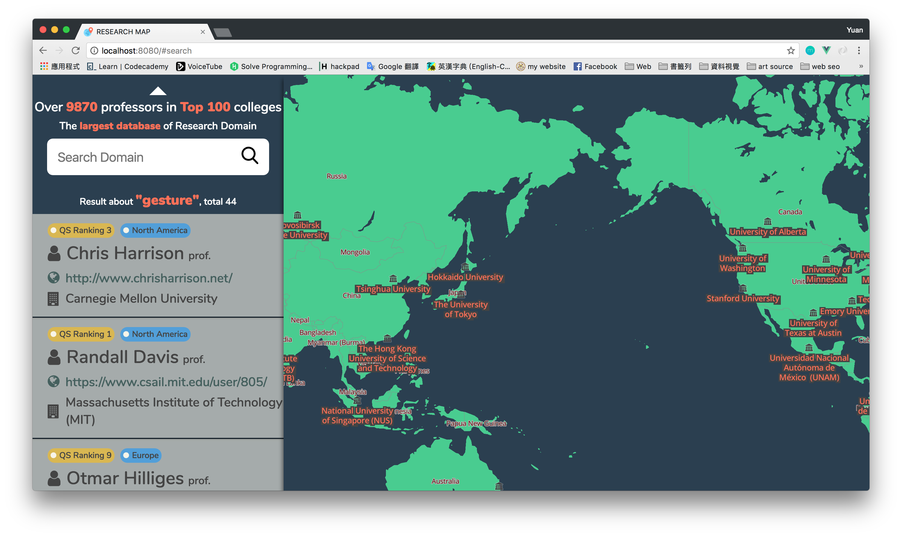

# Research Map - frontend

> Research Map, a innovative system for helping users with this issue by collecting data from four popular websites to get the worldwide professors information and providing the retrieval system to get the most suitable one.



## Visualization

> Research Map wants to show where is the professor on the map and professor’s homepage.



## Build Setup

``` bash
# install dependencies
npm install

# serve with hot reload at localhost:8080
npm run dev

# build for production with minification
npm run build

# build for production and view the bundle analyzer report
npm run build --report
```

For detailed explanation on how things work, checkout the [guide](http://vuejs-templates.github.io/webpack/) and [docs for vue-loader](http://vuejs.github.io/vue-loader).
